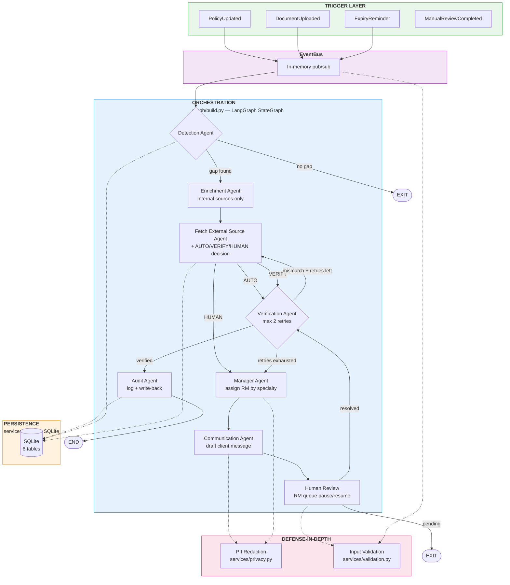
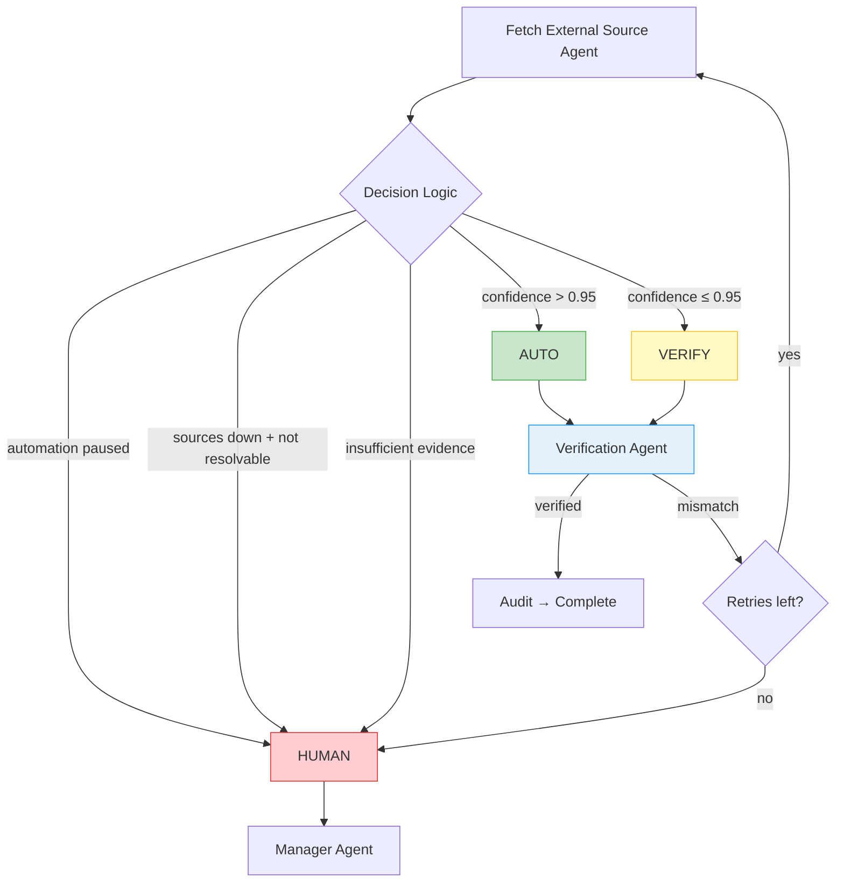
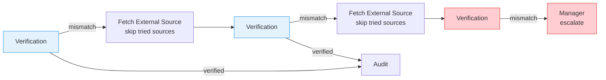
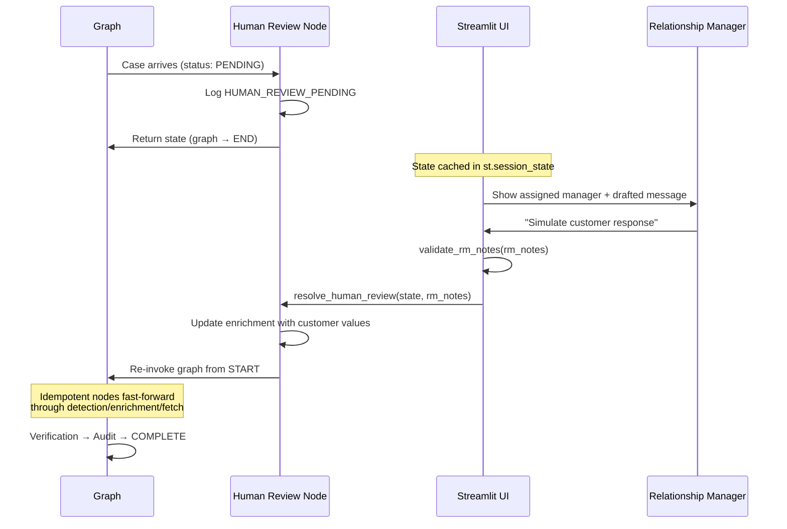
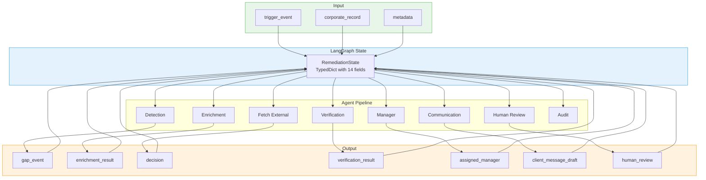
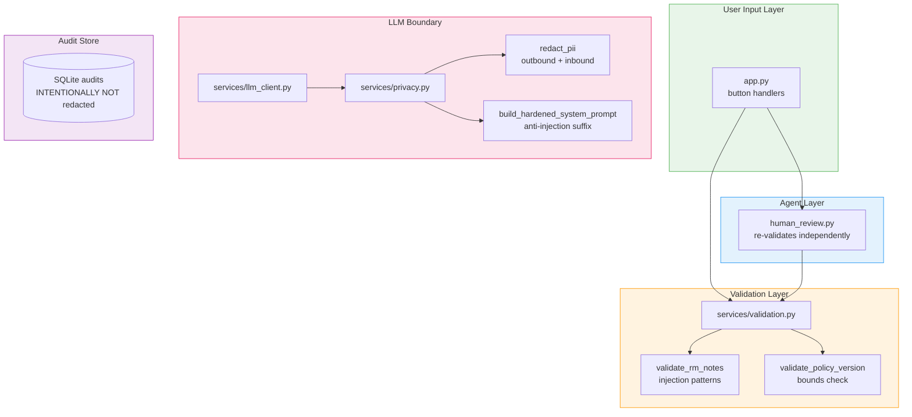
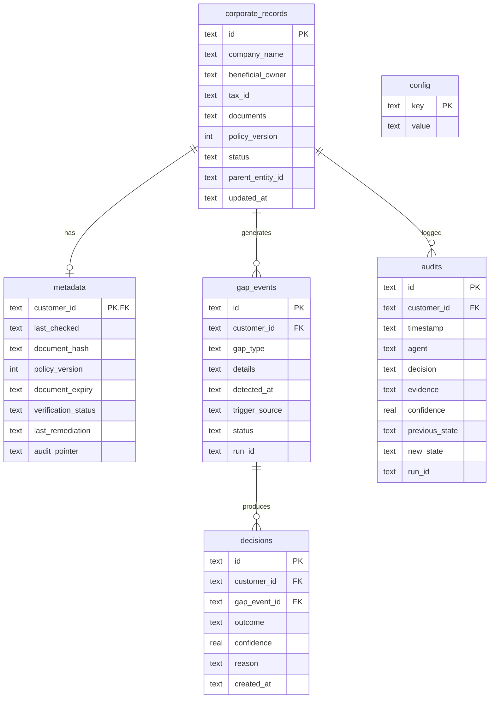

# Corporate KYC Remediation Loop — Architecture

> Detailed architecture with Mermaid diagrams. Each diagram maps to the presentation flowchart.

---

## 1. Main System Flow

This is the primary remediation pipeline — maps directly to the flowchart on screen.

**How it works:**
- Triggers enter via the EventBus and invoke the LangGraph pipeline
- Detection checks for gaps; if none, the graph exits immediately
- Enrichment queries internal sources (CRM, Previous KYC) — cheap and fast
- Fetch External Source tries external registries, then decides AUTO/VERIFY/HUMAN
- Verification checks enriched data against an official source; retries up to 2×
- Manager assigns an RM and drafts a case summary
- Communication drafts a client message — AI never contacts client directly
- Human Review pauses the case; RM resolves it; graph resumes
- Audit logs every action and writes back to corporate_records/metadata
- PII redaction and input validation guard the LLM boundary and user inputs

---

## 2. Decision Routing

After enrichment, the system decides how to proceed based on confidence and source availability.

**Code:** `agents/fetch_external_source.py:87-108` (decision logic), `agents/verification.py:24-66` (retry loop)

---

## 3. Verification Retry Loop

On mismatch, the system retries with the next-best source before escalating.

**Why bounded:** Prevents infinite loops. Each attempt is logged distinctly (`VERIFICATION_FAILED_RETRY1`, `_RETRY2`, `_ESCALATED`) for full audit visibility.

**Code:** `agents/verification.py:24` — `MAX_RETRIES = 2`

---

## 4. Human-in-the-Loop Pause/Resume

The two-phase re-invoke pattern for human review.

**Why two-phase re-invoke:** Simpler than LangGraph's `interrupt()` + `SqliteSaver` checkpointer. Works for single-session demo; production would use durable checkpointer.

**Code:** `agents/human_review.py:51-100` (resolve), `graph/build.py:134-139` (resume)

---

## 5. Data Flow Between Components

**Key insight:** All agents read from and write to a shared `RemediationState` TypedDict. The LangGraph runtime handles state threading between nodes.

---

## 6. Defense-in-Depth Architecture

**What's redacted:** `beneficial_owner` and `tax_id` never reach the LLM. All LLM-bound text is scanned and redacted.

**What's NOT redacted:** The SQLite `audits` table keeps full, unredacted detail — this is the compliance record.

**Code:** `services/privacy.py` (redaction), `services/validation.py` (injection checks), `services/llm_client.py:86-99` (applied in `complete()`)

---

## 7. SQLite ER Diagram

**Schema:** `services/db.py:20-82`

---

## 8. Component Responsibilities

| Component | File | Responsibility |
|---|---|---|
| `app.py` | Streamlit entrypoint | UI layout, event handlers, session state |
| `events/bus.py` | In-memory pub/sub | Decouples triggers from handlers |
| `events/types.py` | Event dataclasses | 4 event types as typed dataclasses |
| `graph/build.py` | LangGraph wiring | StateGraph, conditional edges, dispatcher helpers |
| `models/state.py` | RemediationState | TypedDict shared across all agents |
| `models/entities.py` | Pydantic models | Entity definitions mirroring SQLite schema |
| `agents/detection.py` | Gap detection | 5 gap types, priority-ordered checks |
| `agents/enrichment.py` | Internal enrichment | CRM + Previous KYC lookups |
| `agents/fetch_external_source.py` | External fetch + decision | External registries + AUTO/VERIFY/HUMAN |
| `agents/verification.py` | Data validation | Official source comparison + retry loop |
| `agents/manager.py` | RM assignment | Specialty-based assignment + LLM summary |
| `agents/communication.py` | Message drafting | Client follow-up email draft |
| `agents/human_review.py` | RM queue | Pause/resume + resolve logic |
| `agents/audit.py` | Logging | `log_step()` + terminal write-back |
| `agents/routing.py` | Edge predicates | Conditional routing functions |
| `services/db.py` | SQLite layer | All CRUD operations |
| `services/config.py` | Runtime config | Threshold management |
| `services/mock_sources.py` | Mock data | Internal/external/official sources |
| `services/llm_client.py` | LLM interface | Pluggable provider with template fallback |
| `services/privacy.py` | PII protection | Redaction + hardened prompts |
| `services/validation.py` | Input validation | Injection rejection + bounds checks |
| `mock_data/companies.py` | Seed data | 10 companies with test scenarios |
| `mock_data/managers.py` | RM directory | Specialist assignment rules |
| `migration/seed.py` | Data seeder | Idempotent batch migration |
| `ui/components.py` | UI helpers | Badges, agent cards, timeline |
